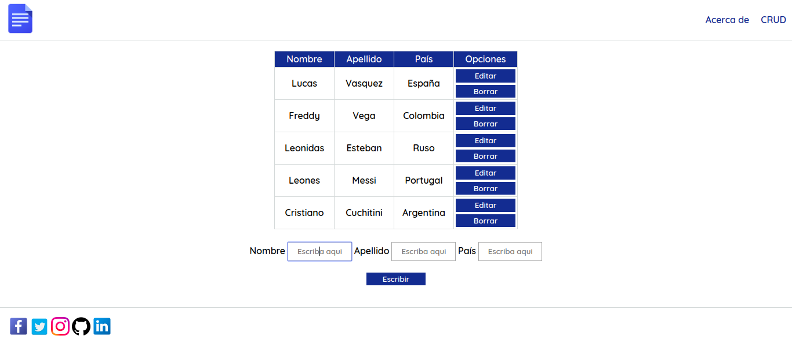

# CRUD con (HTML, CSS y Javascript)

## ¿Que es un CRUD?

CRUD hace referencia a un acrónimo de "Create, Read, Update and Delete" que en español significa "Crear, Leer, Actualizar y Borrar" que son las cuatro funciones básicas de la persistencia de Bases de Datos.

CRUD se usa también a veces para describir convenciones de interfaz de usuario que facilita la vista, búsqueda y modificación de la información; a menudo se usa en programación de formularios (forms) e informes (reports). 

### Funcionamiento
#### Asi es como se vera al principio, debido a que no hemos ingresado datos

Para que luego se ingrese la informacion que ira en nuestra tabla!

#### Luego cuando ya ingresemos datos, se veran así!

Donde tendremos las opciones de editar y eliminar registros para completar nuestro CRUD con HTML, CSS y JS

## Contacto
[Linkedid](https://gt.linkedin.com/in/manuel-flores-abb71a15a/%7Bcountry%3Dno%2C+language%3Dno%7D?trk=people-guest_profile-result-card_result-card_full-click)
